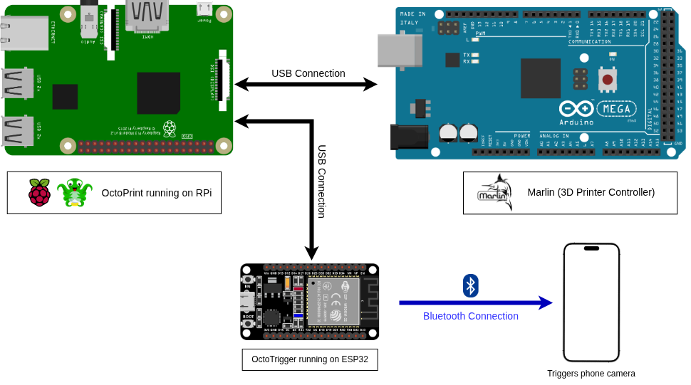

# OctoTrigger

Use your phone camera as a remote shutter for [Octolapse](https://github.com/FormerLurker/Octolapse) instead of a webcam. An ESP32 acts as a BLE keyboard and sends media key presses to a paired phone — pressing volume up fires the camera shutter in any standard camera app.

